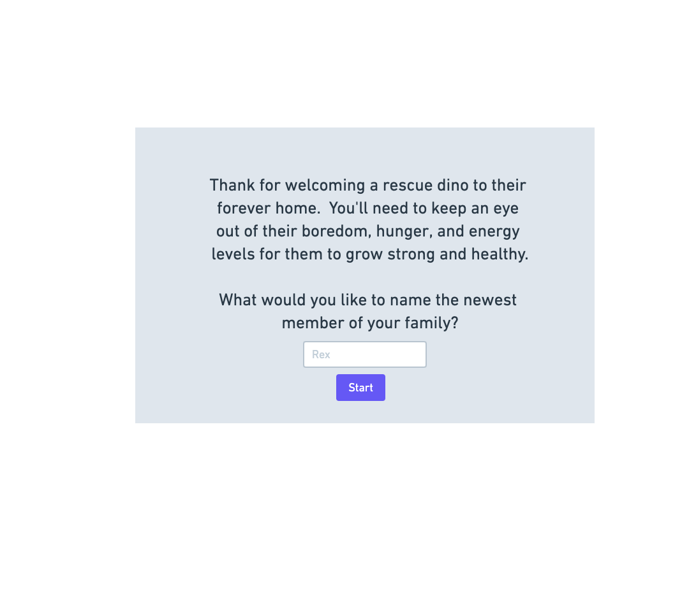
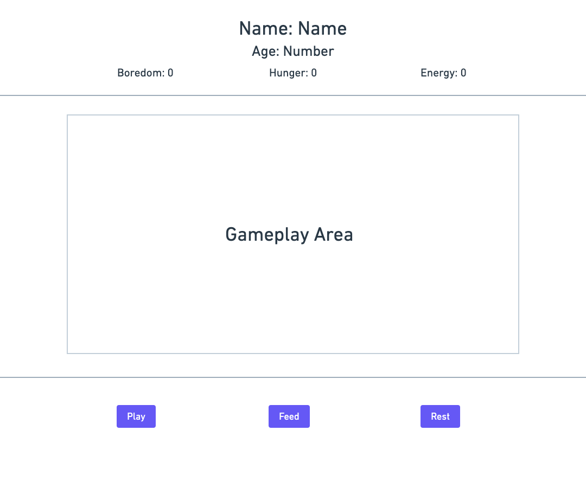

# project-Zero
Tamagotchi game

# User Story

## Start 

Game starts with a window prompt. “Thank you for opening your home and adopting a baby dinosaur from the dinosaur sanctuary.  As his new parent, what would you like to name your newborn dinosaur?

Game has a header, a main section, and a footer.

## Header

Header will contain a pet name which will be an h1 and pet info/stats: age, boredom, hunger, and sleepiness. Pet info/stats will appear as an h2

* Name is set by the user input from the window prompt requesting the user to name their pet.

* Age will begin at zero and increase by 1 every minute

* Boredom will begin at 0 and increase by 1 every 15 seconds.

* Hunger will begin at 0 and increase by 1 every 30 seconds

* Sleepiness will begin at 0 and increase by 1 every 30 seconds

* If either boredom, hunger, or sleepiness reaches 10. Your pet dies.

## Main section

In the center of the main section will be an img, your pet lives inside of this img and will have animation to move across the screen.

Img will at different life stages

* Life stages are at age 3-childhood, 8-adulthood ,15-dead

## Footer

Footer will contain 3 buttons: Play, Feed, Nap/Sleep

* Play button on click will decrease boredom by 2

* Feed button on click will decrease hunger by 4

* Nap/sleep button will decrease sleepiness by 5
